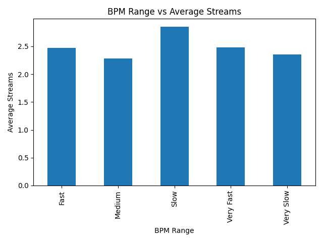
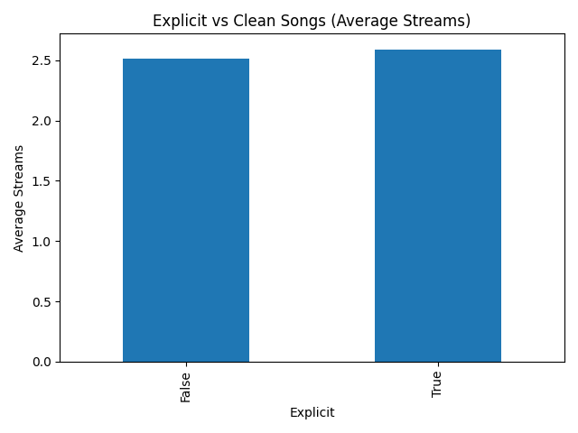
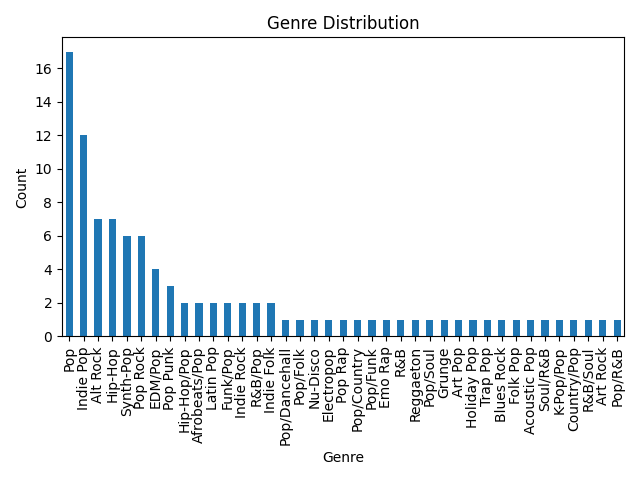
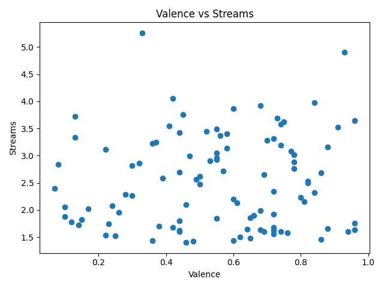

# Spotify Analytics Insight: What Makes a Song Popular?

## Project Overview

This project explores what drives song popularity on Spotify using real-world data from the Spotify Wrapped 2025 dataset.

The goal is to understand how audio features such as **danceability, energy, tempo (BPM), and valence** influence a song’s streaming performance.

By building a structured data analytics pipeline, this project transforms raw datasets into meaningful insights and visualizations that explain patterns behind high-performing songs.

---

## Business Question

**What makes a song successful on Spotify?**

This project answers this by analyzing how musical attributes and metadata impact streaming performance.

---

## Key Insights

- Songs with higher **energy and danceability** tend to achieve more streams  
- **Explicit songs** show slightly higher average streaming performance  
- Certain **BPM ranges (100–130)** dominate high-performing tracks  
- **Valence (happiness)** has a moderate positive relationship with streams  
- Popular songs are heavily concentrated in mainstream genres  

---

## What This Project Demonstrates

- End-to-end **data analytics workflow**
- Data cleaning and preprocessing using **Pandas**
- Exploratory Data Analysis (**EDA**)
- Data visualization using **Matplotlib**
- Extracting actionable insights from real-world datasets
- Writing clean, modular, and reproducible Python code

---

## Project Structure

```
Spotify-Analytics-Insight/
│
├── data/
│
├── raw/ │   │   ├── spotify_alltime_top100_songs.csv │   │   ├── spotify_wrapped_2025_top50_artists.csv │   │   └── spotify_wrapped_2025_top50_songs.csv │   └── processed/ │       └── cleaned_data.csv │ ├── notebooks/ │   └── spotify_analysis.ipynb │ ├── reports/ │   └── insights.md │ ├── src/ │   ├── data_cleaning.py │   └── analysis.py │ ├── visuals/ │   ├── bpm_vs_streams.png │   ├── explicit_vs_streams.png │   ├── genre_distribution.png │   └── valence_vs_streams.png │ ├── README.md ├── requirements.txt └── .gitignore
```
---

## Installation & Setup

Clone the repository:

```
git clone https://github.com/Nomusa990822/Spotify-Analytics-Insight.git
cd Spotify-Analytics-Insight
```

Install dependencies:
```
pip install -r requirements.txt
```

---

## How to Run

Step 1: Clean the Data
```
python src/data_cleaning.py
```

Step 2: Run Analysis
```
python src/analysis.py
```

**Outputs:**

Clean dataset saved in ```data/processed/```
Visualizations saved in ```visuals/```

---
# Sample Visualizations

## 📊 Sample Visualizations

### BPM vs Streams


_Mid-tempo songs tend to achieve higher streaming performance, suggesting an optimal BPM range for mainstream appeal._


### Explicit vs Clean Songs


_Explicit songs show slightly higher average streams, indicating a potential listener preference for unfiltered or expressive content._


### Genre Distribution


_A few dominant genres account for most top-performing songs, highlighting the concentration of popularity within specific music categories._


### Valence vs Streams


_No strong correlation observed — both high and low valence songs can achieve high streaming performance._

---
## Key Takeaways

- Popularity is influenced by multiple audio features rather than a single dominant factor  
- Mid-range BPM and higher energy levels tend to perform better  
- Content type (explicit vs clean) may influence listener engagement  
- Emotional tone (valence) alone is not a strong predictor of success

---
## Dataset
Dataset sourced from Kaggle:

**Spotify Wrapped 2025 Top Songs & Artists**

This dataset includes:
- Song metadata
- Audio features (BPM, energy, danceability, valence)
- Streaming performance metrics

---
## Analysis Questions Explored

1. What BPM range produces the most streamed songs?
2. Do explicit songs perform better than clean songs?
3. How does valence (happiness) affect streams?
4. Which genres dominate top-performing songs?
5. What audio features define high-performing tracks?

---

## Tools & Technologies

- Python
- Pandas
- NumPy
- Matplotlib
- Jupyter Notebook

---
## Summary

This project demonstrates the ability to:
- Work with real-world datasets
- Clean and preprocess messy data
- Perform exploratory data analysis
- Communicate insights through visualizations
- Structure a complete analytics pipeline

---

## Future Improvements
- Build an interactive dashboard (Power BI / Tableau)
- Develop a machine learning model for prediction
- Add SQL-based analysis

---
## Feedback & Contributions
Feedback, suggestions, and improvements are always welcome.
If you found this project useful or interesting, feel free to ⭐ the repository and share your thoughts!
